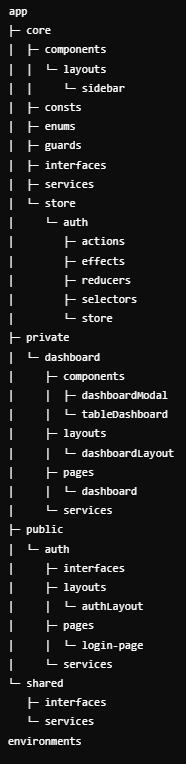

# Proyecto Javier Jure - Eldar challenge

## Descripción

Eldar challenge de autenticación de usuario, con roles admin y user. Con una tabla para visualizar los datos, que varia en sus acciones dependiendo del rol que posea el usuario.

## Tecnologías

- Angular
- Ngrx
- PrimeNG
- PrimeFlex
- Scss

---

## Requisitos previos

- Node.js (>= v20)
- Angular CLI (>= 18.2.10)

---

## Usuarios

Usuarios pares son rol admin:

```bash
Antonette
```

Usuarios impares son rol user:

```bash
Bret
```

Password hay que escribirla pero no es necesaria, cualquier contraseña te dejara pasar.

```bash
Minima cantidad de caracteres de una password son 6. Password: 123456
```

## Instalación

### 1. Clonar el repositorio

Para comenzar, clona este repositorio en tu máquina local utilizando uno de los siguientes comandos:

Https:

```bash
git clone https://github.com/jurej13/Eldar-challenge.git
```

SSH:

```bash
git clone git@github.com:jurej13/Eldar-challenge.git
```

### 2. Instalar dependencias

Una vez descargado el proyecto, accede a la carpeta y ejecuta el siguiente comando para instalar las dependencias necesarias:

```bash
npm install
```

### 3. Ejecutar el servidor

Con las dependencias instaladas, ya puedes iniciar el servidor. La configuración de entorno necesaria está incluida en el repositorio (esto facilita el testeo pero no es una práctica recomendada para producción).

Para iniciar el servidor:

```bash
ng serve
```

Para iniciar el servidor y abrir automáticamente en el navegador:

```bash
ng serve -o
```

### 4. Uso

Accede a http://localhost:4200 en tu navegador para ver la aplicación en funcionamiento.

### Estructura del Proyecto



## Shared

Servicio de busqueda de data de posts. Se encuentra aca por si se necesitaria llamar a este servicio desde otros componentes que puedan llegar a necesitar los posts.

## Core

Core de la aplicacion, store, enums, consts, guards, etc.

## Explicacion de uso:

Al ingresar en la aplicacion, deberias poder ver un formulario con el cual logearte. Solo te dejara ingresar con usuarios que esten en la api de : https://jsonplaceholder.typicode.com/guide/ . Al entrar en la aplicacion, se deberia poder visualizar una tabla con posts que vienen de la misma api, donde si sos rol user solo podras visualizarlos, y si sos rol admin podras ser capaz de eliminarlos y crear nuevos. A la hora de crear uno nuevo, a ese registro no se puede editarlo debido a que estos cambios que se realizan no persisten en la base de datos. Con el resto de registros se podra visualizar cuadno se crean , y editan.
